## Welcome to the Reading and Watch-List Dashboard Web App

This app consists of a **Chrome extension** as well as an **Web app**.

### Tech Stack

- We have made our **Extension Frontend** code using ReactJS, which is complied into html,js and css with the help of Vite Bundler with other dependencies incluing axios, React-Router,

<p align="center">
  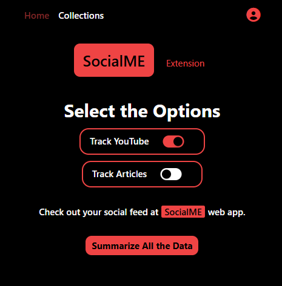
</p>


- The **Backend** part is done in JavaScript in NodeJS environment, along with ExpressJs and other dependencies incluiding dotenv, mongoose, JWT, bcrypt, cookieParser.

- For **DataBase** we have used MongoDB, which is being connected with our app with the help of mongoose.Login/SignUp feature is also implemented.
<p align="center">
  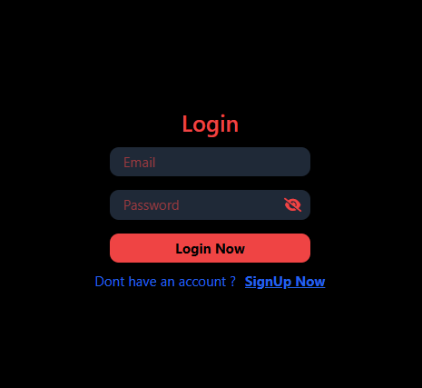
  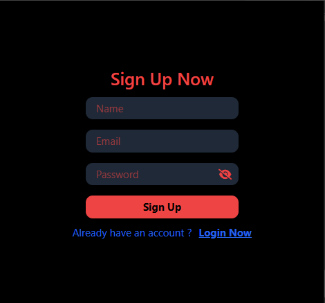
</p>

- The **Web App Frontend** is also made in ReactJs
<p align="center">
  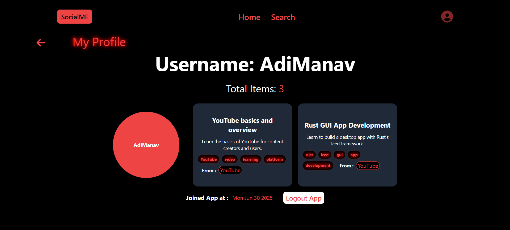
  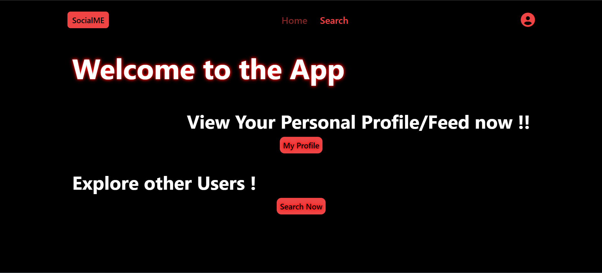
  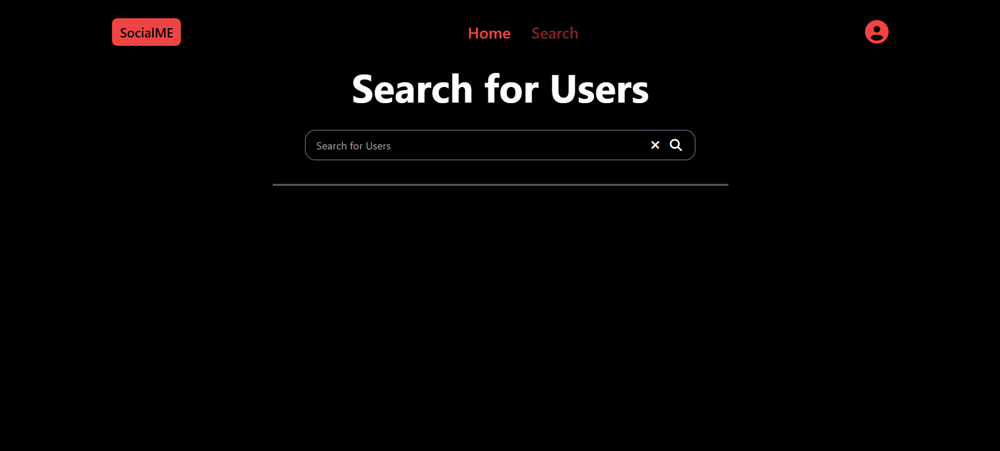
</p>

> So in general we have used mostly **MERN Stack** for this whole project

- Another crucial module which is the main heart of the app is **WEB-LLM**, we have used the **Web-LLm by MLC Ai**, which summarises the users browsed articles, youtube videos, and make it display as a summary/feed type of in the web app, which also acts as social media where users can also view other person's feed as well.

#### We have named the app or rather platform as **SocialME**.

<p align="center">
  
</p>

## Features and Cool Functionalites of the App

1. This both app and extension are compatible in **Google Chrome Browser**. The user can on starting signup in the app, and thus their progress/ feed gets saved and is **synced** with the social media app.

2. They do **not need** to **sign in** **over and over again**, as with the help of **JWT**, their login info is ****automatically checked** with **api end point** /check-auth, so they will be remain loggedIn/signin to both app and extension, unless they manually prefer to logout.

3. There is also another implementation that user has a choice of having **optional tracking**.That is in the extension they can select out of **youtube and articles**, what should be tracked , or none of them should be tracked, This is implemtend with the help of **chrome storage, sync and other inbuild API's.**

4. The **WEB LLm** runs as according to the wish of the user, there is a **button** which says **summarize all**, so the user click on summarize whenever he feels to be. This **reduces the load** on the browser, as llm will be loaded according to the wish of the user.

5. The WEB-LLM code has been implemented with the help of **service-worker** in google chrome, named **background.js** in our case, which runs a ****js script in background context** of the chrome browser. So ****no API for LLM** is been used, the LLM , which is **Gemma-2-2b-it-q4f16_1-MLC**(which is a good yet light weight llm with 2 billion params) is runned **inside browser** only, **locally**(which the WEBLLM downloads files from Hugging face.).

6. All of the **error hanlding** is done, so if user tries to sign in (if already have an account, password less than 8 characters, login password/details incorrect, response internal server(backend) error, WEBLLM error) all the errors have been taken into account **with proper** frontend **response**.

7. The **App/Platform/Cross-Platfrom Security** has been taken into consideration with the help of **bcrypt** module, which applies a **cryptographic algorithim** when saving/searching for user by its Id or password in the DataBase, along with the **JWT** which just **authenticates valid users** with a generated secured token whose valididty is of 1days always which has been **implemented in every backend api end point**.

8. The Users can **not only securly watch their profile summary**, but also they could **search for other users feed**, just by typing in the search box in the Search Section. This makes the app **feel like** a **social media app** where people could browse the other person's current digital activity, not directly(obviosly as its against user privacy) but it **lets know the intrests of the user**.

9. **The UI design** along with the **React Router DOM** has made the app **more smooother**, just like a **single page applcation** without lags, in both extension as well as the app.

10. And many necessary things are **managed** using the **environment variables** in the backend mainly with the help of **dotenv**.

> This list will never end, you could give a try yourself to the app.

## How to Run It Yourself
Follow up on Below

### Step-1
This will clone the repository in your local pc
```
git clone https://github.com/Madhav64OP/tracker_reading_list_app.git
```
### Step-2
**App Frontend setup**
```
cd app/app_frontend
```

```
npm install
```
```
npm run dev
```
This will install node module folder and will run the app on localhost.

### Make sure to check the port, on which app is running, as you might need to white list it too with backend

<p align="center">
  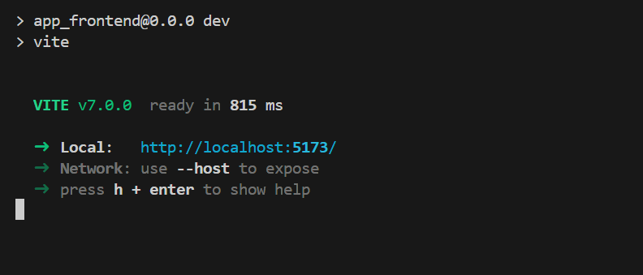
</p>
The port like in this case is 5173.

```
cd ../../
```
### Step - 3
```
cd extension/extension_frontend
```
```
npm run setup
```

After that, go to your Chrome Browser.
- Click on three dots at right side
<p align="center">
  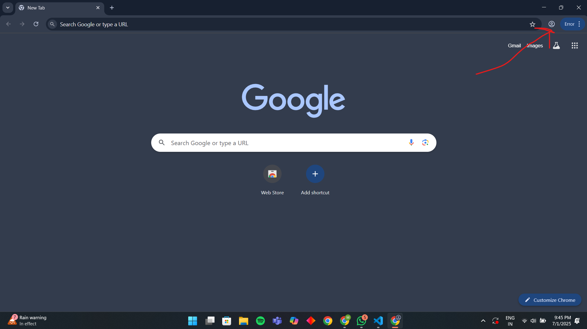
</p>

- Go to Extensions, and Click Manage Extensions
<p align="center">
  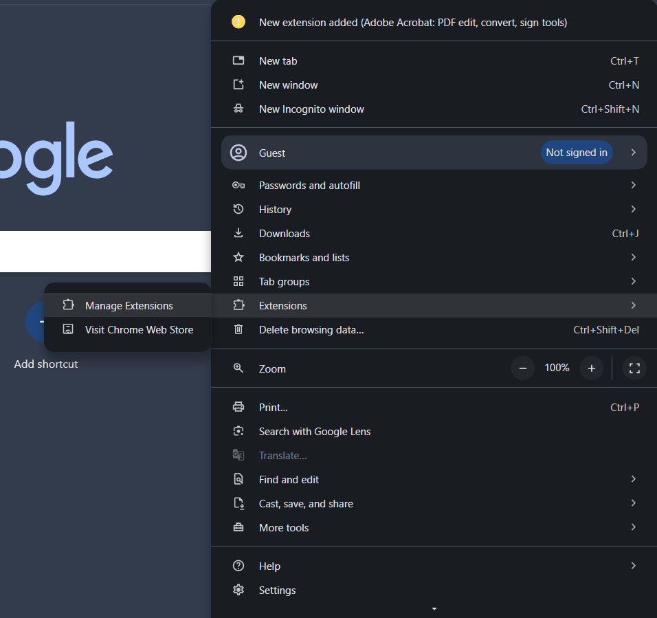
</p>

- Turn on Developer's Mode
<p align="center">
  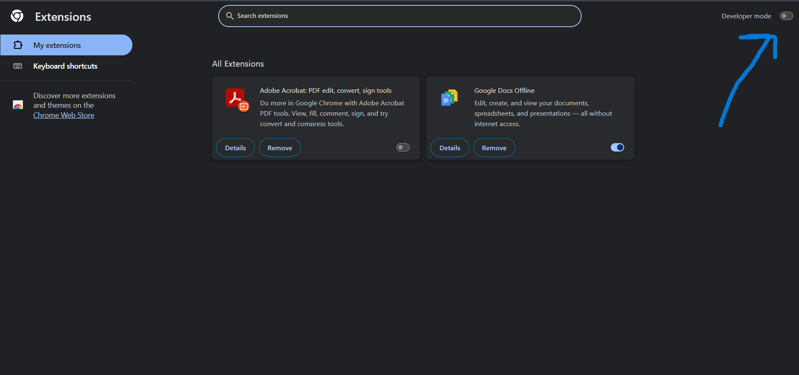
</p>

- Click on Load Unpacked and open the dist folder in this **extension/extension_frontend/** and then **dist** folder
<p align="center">
  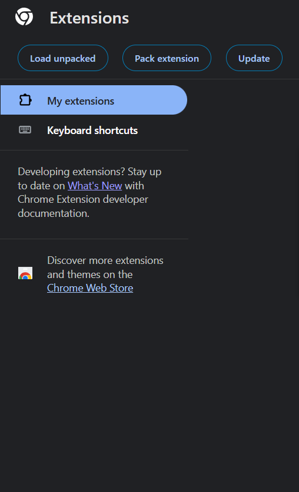
</p>

#### This will set up the frontend of extension, and the extension will be ready to use, once the backend server is started.

### Step-4 Setting Up the Backend 

```
cd extension/extension_backend
```

```
npm run setup
```

Then here comes the crucil Part, you need to make a free account on MongoDB Atlas, its simple, just follow up on the below detials.

- Go to MongoDB [MongoDB](https://www.mongodb.com/cloud/atlas/register) and create an account.
- Accept the privacy policy and click next/submit,
- Click on Skip Personalization Below
<p align="center">
  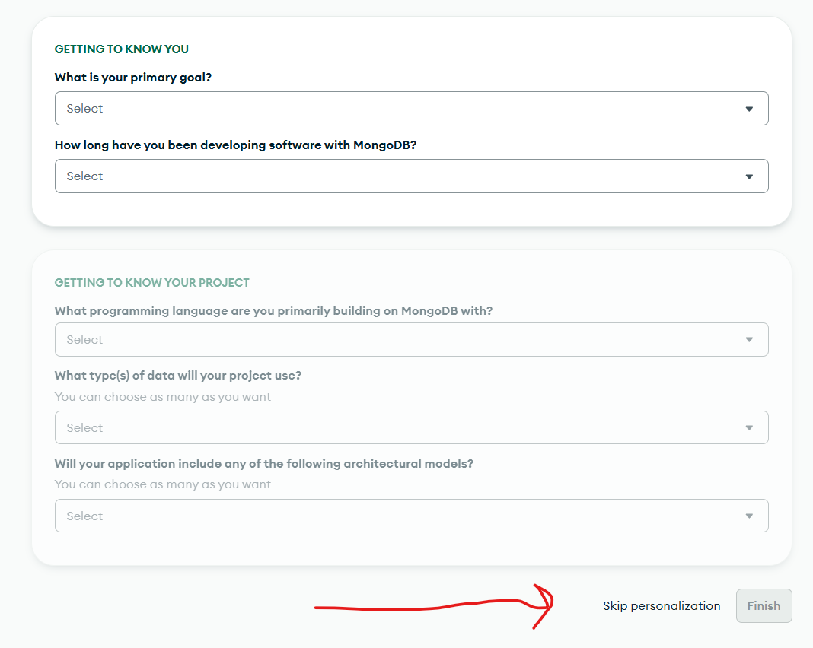
</p>

- Select Free and Click Create Deployment (Or you could name the cluster according to your wish)
<p align="center">
  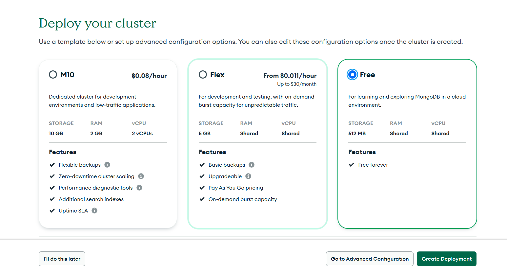
</p>

- Once your cluster will be created, you will now have a popup like this, Just click close , and go to Network Access in The Home page. and add ip address and click Allow Access From Anywhere. 
<p align="center">
  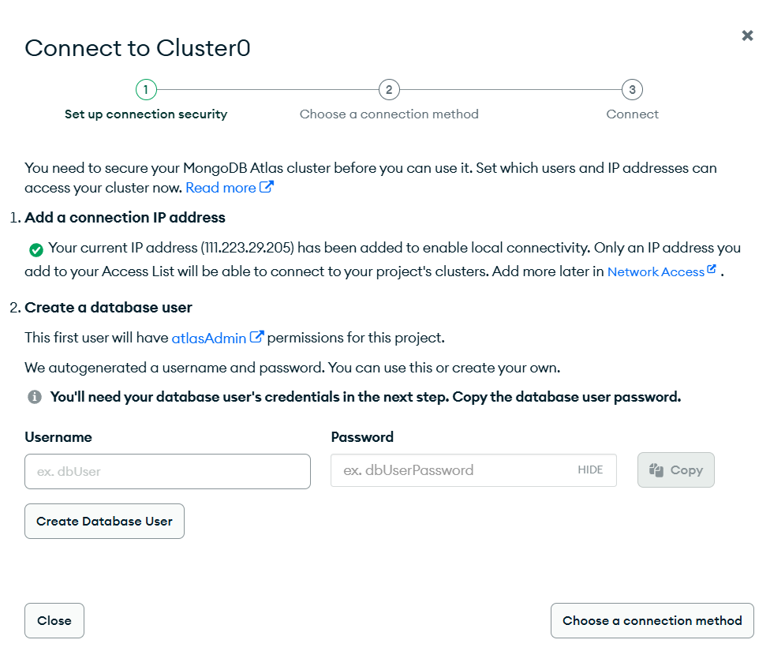
</p>

- Then Go to database access, and click Add a New Database User, Select Password, enter username and password, then select build in role to be Atlas admin. Then Click Add User, and your user will be added in there.
<p align="center">
  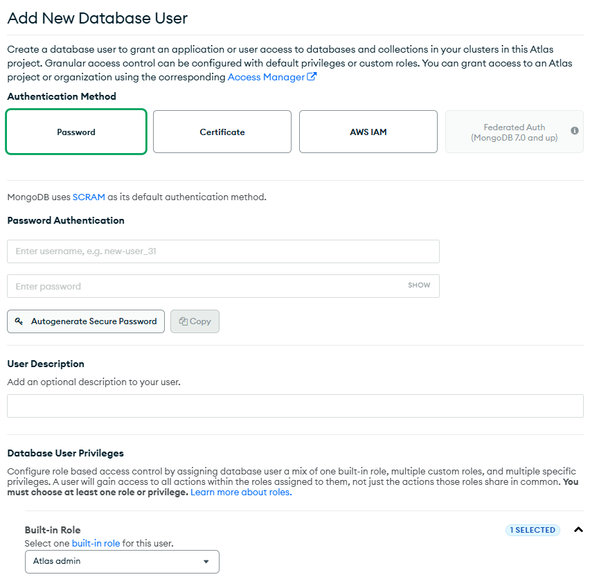
</p>

- Go to DataBase Option in Left menu, and click Clusters,then click connect, you will get many options in there. Select Compass, then you will get your MongoDB String. You just need that it will look something likle below
<p align="center">
  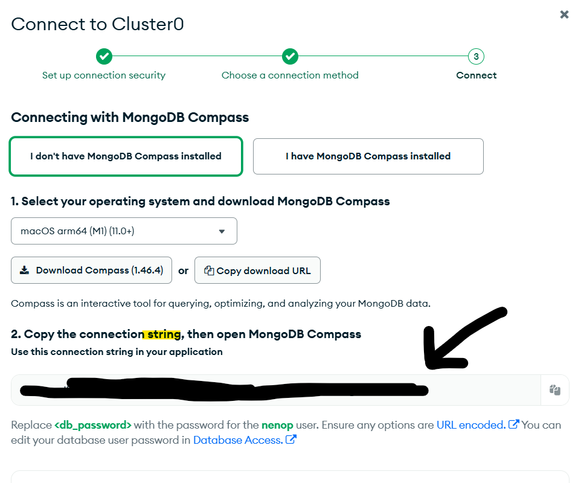
</p>

>mongodb+srv//{you_username}<db_password>@cluster0.{some_charaacters}.net/

This is the main thing you need, you could also install MongoDB compass if you want, and you could connect it with this stiring as well.

### Step-5 Setting the Env variables

#### Just look into the .env_sample file, all detials are also provided within it as well. 
Just rename **.env_sample** to **.env** and change the variables as mentioned in there.

You need to copy this and paste into the environment variable named MONGO_DB_URI=that string without the last / under the .env_sample file.
i.e  **MONGO_DB_URI=mongodb+srv//{you_username}<db_password>@cluster0.{some_charaacters}.net**

### For setting other environment variables
>PORT=3000

>MONGO_DB_URI=MONGO_DB_URI=mongodb+srv//{you_username}<db_password>@cluster0.{some_charaacters}.net

>DB_NAME=trackerReadingListApp (you can also change its name.)

>JWT_SECRET= (Make any complex secret key just as of your wish of atleast 20char, ot you could get a free random generated at JWT Website https://jwt.io/)

>CORS_ORIGIN=(make sure to add the socail media app local hsot url here, for example: http://localhost:5173)

#### Finally, Start the backend server.
```
npm run start
```
#### And Server will run.

## Now you could freely work with you app, make any changes according to you.


